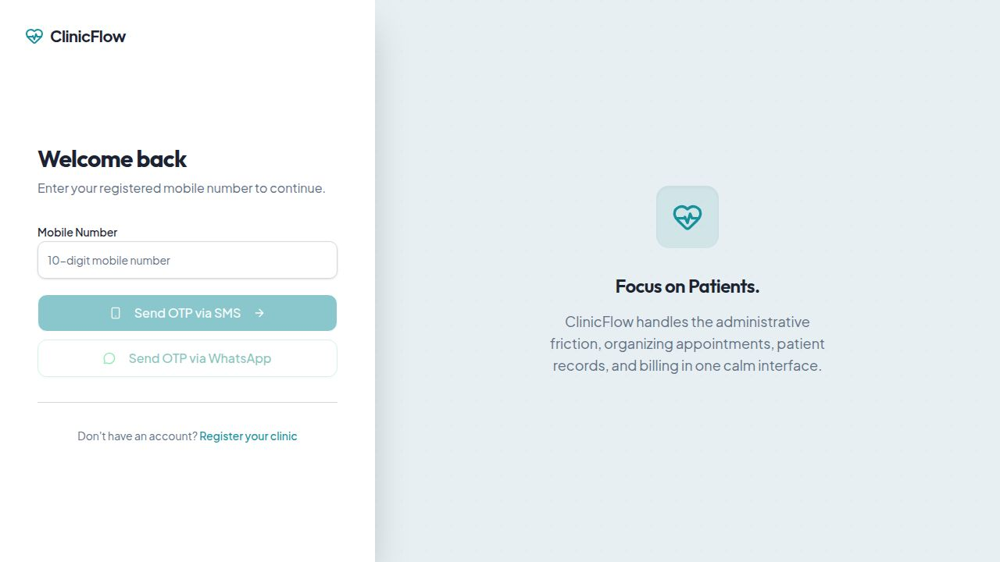
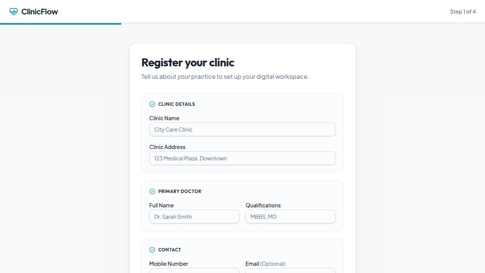

# ClinicFlow

A modern, component-based workflow automation system built for small city doctor clinics. Handles the full patient journey — from reception check-in to doctor consultation — in a single, beautiful interface.

---

## Screenshots

### Login


### Clinic Registration (Step 1 of 4)


---

## Features

### Auth & Clinic Setup
- OTP-based login via SMS or WhatsApp
- 4-step clinic registration wizard (clinic details, doctor profile, staff, confirmation)
- Unique clinic invite codes for adding staff

### Doctor Dashboard
- Live patient queue with token numbers, waiting time timer
- One-click "Call Next" to bring patient in
- Full patient detail modal — identity, vitals, complete visit history
- Mark visit as complete with prescription notes

### Reception Dashboard
- **Check-in tab** — mobile number search, auto-detects returning patients, new patient form with vitals
- **Queue tab** — live patient list with token/status/complaints/vitals, auto-refresh every 10 seconds
- Edit waiting patient details (symptoms + vitals) with a single tap
- Upload prescription images (camera or gallery) with automatic compression

### Settings / Staff Panel
- Manage staff members (add / remove / view roles)
- Roles: Doctor, Receptionist, Manager, Admin

---

## Tech Stack

| Layer | Technology |
|---|---|
| Frontend | React 18, Vite, TypeScript |
| UI | shadcn/ui, Tailwind CSS, Framer Motion |
| Backend | Express.js, Node.js |
| Database | PostgreSQL (Drizzle ORM) |
| Auth | OTP via SMS (Twilio / Fast2SMS) |
| Monorepo | pnpm workspaces |

---

## Project Structure

```
clinicflow/
├── artifacts/
│   ├── clinic-auth/          # React + Vite frontend
│   │   └── src/pages/
│   │       ├── login.tsx
│   │       ├── register.tsx
│   │       ├── doctor.tsx
│   │       ├── reception.tsx
│   │       └── settings-panel.tsx
│   └── api-server/           # Express backend
│       └── src/routes/
│           ├── auth.ts
│           ├── doctor.ts
│           └── reception.ts
└── lib/
    └── db/                   # Drizzle schema + migrations
        └── src/schema/
```

---

## Getting Started

### Prerequisites
- Node.js 18+
- pnpm
- PostgreSQL database

### Setup

```bash
# Install dependencies
pnpm install

# Push database schema
cd lib/db && npx drizzle-kit push

# Start API server
pnpm --filter @workspace/api-server run dev

# Start frontend
pnpm --filter @workspace/clinic-auth run dev
```

### Environment Variables

Create `.env` in `artifacts/api-server/`:

```env
DATABASE_URL=postgresql://...
SESSION_SECRET=your_secret_here
TWILIO_ACCOUNT_SID=...
TWILIO_AUTH_TOKEN=...
TWILIO_PHONE_NUMBER=...
```

---

## User Roles

| Role | Dashboard | Capabilities |
|---|---|---|
| Doctor | `/doctor` | View queue, manage consultations |
| Receptionist | `/reception` | Check-in patients, manage queue |
| Manager | `/manager_dashboard` | Overview & reports |
| Admin | `/settings` | Full access + staff management |

---

## How It Works

1. **Clinic registers** → gets a unique invite code
2. **Staff joins** using the invite code → selects their role
3. **Reception checks in patients** → assigns token numbers
4. **Doctor sees live queue** → calls patients one by one
5. **Visit is completed** → prescription uploaded, record saved

---

Built with care for small clinics that need big-clinic efficiency.
